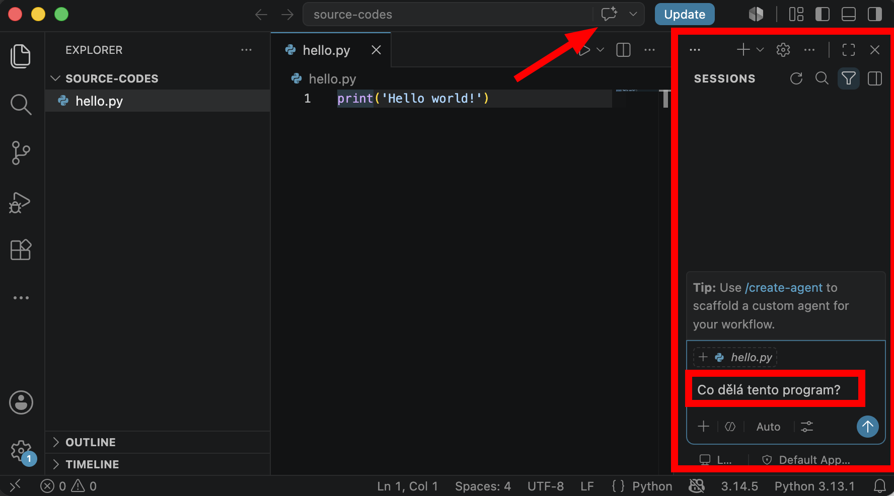

# Teorie: Vývojové prostředí

## Co je vývojové prostředí

Vývojové prostředí je program, ve kterém vývojáři píší kód. My budeme používat *Visual Studio Code* (VS Code), ale existují mnohé další.

### Proč používat vývojové prostředí?
- barevně zvýrazní příkazy a důležité části kódu,
- ukáže chyby ještě před spuštěním,
- umožňuje spouštět kód jedním kliknutím,
- díky gitu můžeš sledovat vývoj projektu a spolupracovat s kolegy,
- zahrnuje nástroje pro psaní s AI.

> Zkratka pro vývojové prostředí je **IDE** (*Integrated Development Environment*). V češtině se říká *(integrované) vývojové prostředí*.

### Šlo by to bez IDE?
Ano, šlo. 

1. Python lze psát v obyčejném textovém editoru a spustit ho z příkazové řádky, ale je to nepohodlné.

2. Na rychlé vyzkoušení můžeš použít weby jako [Online Python](https://www.online-python.com/). Ale IDE toho zvládne víc.

# Praxe: První skript v Pythonu

## Jak vytvořit skript ve Visual Studiu?
- otevři VS Code,
- vyber volbu *New File...* (nový soubor),
   
- zadej název svého prvního skriptu `hello.py`,
- zvol složku, do které skript uložíš,
- zapiš svůj první kód: 
  ```python
  print("Ahoj světe!")
  ```
- V levém okně (*Explorer*) zvol položku *add a folder* pro otevření složky se skriptem.
   

## Spuštění skriptu:
- ve většině IDE je zelená šipka Spustit – ve VS Code je vpravo nahoře,
- při první spuštění skriptu budeš možná muset zvolit interpreter (překladač).


> Pokud máš Python správně nainstalovaný, můžeš také otevřít terminál ve složce se skriptem a napsat `python hello.py`.

# AI asistent ve VS Code

Ve Visual Studio Code můžeš používat AI asistenta, který ti pomáhá s psaním kódu, vysvětlením chyb nebo návrhem jednoduchých úprav.



> AI je užitečný pomocník, ale ne automatická náhrada za vlastní myšlení. Nejlepší je používat ho jako radu, ne jako hotové řešení bez pochopení.

## Jak s AI pracovat?
- Požádej asistenta, aby navrhl kód: „Napiš program, který vypíše moje jméno.“
- Požádej AI, aby ti vysvětlila, jak kód funguje: „Buď můj učitel programování. Vysvětli mi, jak kód funguje a co bych se měl naučit.“
- Výsledek vždy zkontroluj a pochop, co přesně dělá,
- Pokud je něco nejasné, zeptej se znovu a požádej o kratší vysvětlení.

> AI ti může hodně pomoct, ale produkt vytvořený za 15 minut má stále hodnotu jen těch 15 minut práce. (I když vypadá úžasně.)
> Jestli má tvoje aplikace opravdu stát za to, musíš do něj vložit vlastní nápad, zkušenost a porozumění. Musíš se jí věnovat a vylepšovat ji. To bude její skutečná hodnota.