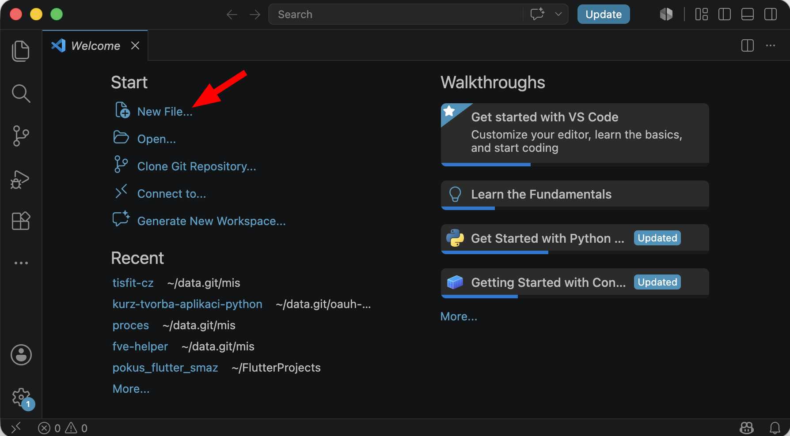
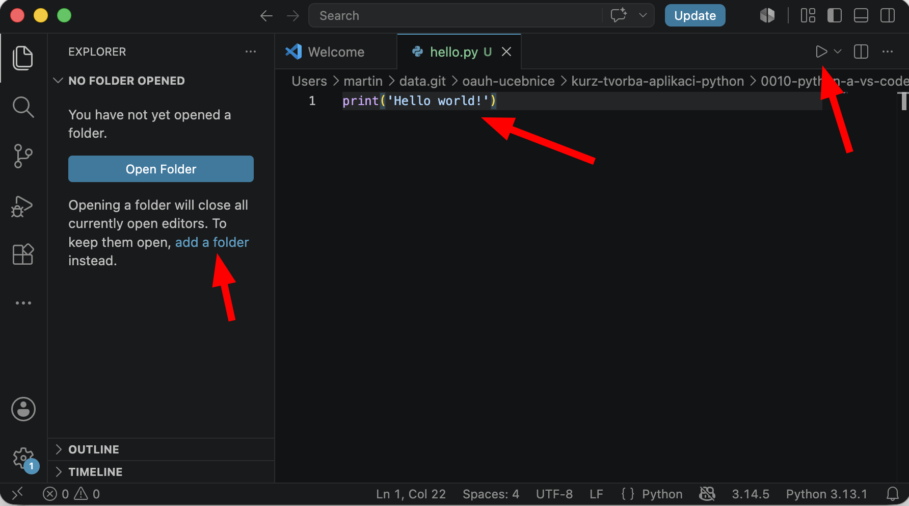
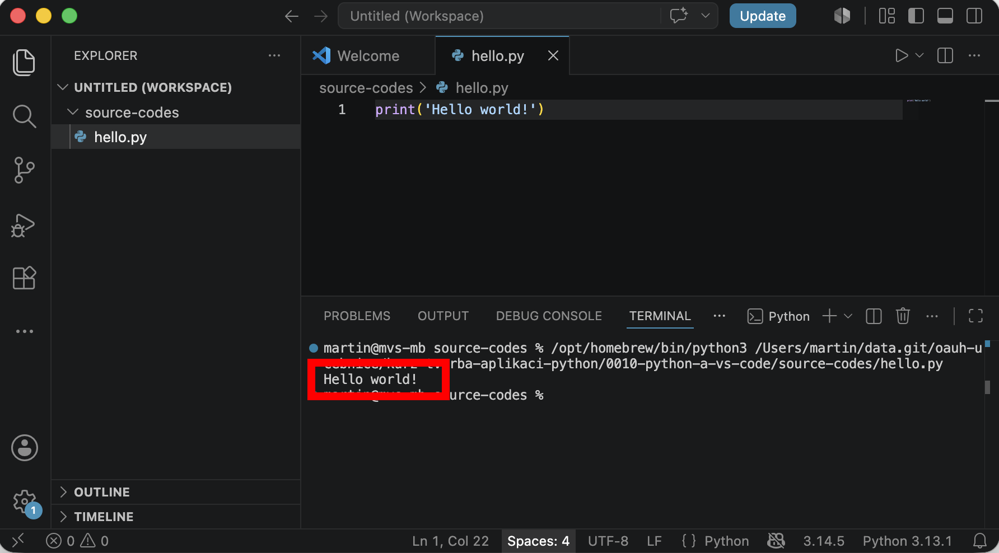

# Teorie: Vývojové prostředí

## Co je vývojové prostředí

Vývojové prostředí je program, ve kterém vývojáři píší kód. My budeme používat *Visual Studio Code*, ale existují mnohé další.

### Proč používat vývojové prostředí?
- barevně zvýrazní příkazy a důležité části kódu,
- ukáže chyby ještě před spuštěním,
- umožňuje spouštět kód jedním kliknutím,
- díky gitu můžeš sledovat vývoj projektu a spolupracovat s kolegy,
- zahrnuje nástroje pro psaní s AI.

> Zkratka pro vývojové prostředí je **IDE** (*Integrated Development Environment*). V češtině se říká *(integrované) vývojové prostředí*.

### Šlo by to bez IDE?
Ano, šlo. 

1. Python lze psát v obyčejném textovém editoru a spustit ho z příkazové řádky, ale je to nepohodlné.

2. Na rychlé vyzkoušení můžeš použít weby jako [Online Python](https://www.online-python.com/). Ale IDE toho zvládne víc.

# Praxe: První skript v Pythonu

<!-- TODO: Doplň obrázek -->

## Jak vytvořit skript ve Visual Studiu?
- otevři VS Code,
- vyber volbu *New File...* (nový soubor),
- zadej název svého prvního skriptu `hello.py`,
- zvol složku, do které skript uložíš,
- zapiš svůj první kód: `print('Hello world!')`
- V levém okně (*Explorer*) zvol položku *add a folder* pro otevření složky se skriptem.

 
 

## Spuštění skriptu:
- ve většině IDE je zelená šipka Spustit – ve VS Code je vpravo nahoře,
- při první spuštění skriptu budeš možná muset zvolit interpreter (překladač).

> Pokud máš Python správně nainstalovaný, můžeš také otevřít terminál ve složce se skriptem a napsat `python hello.py`.

