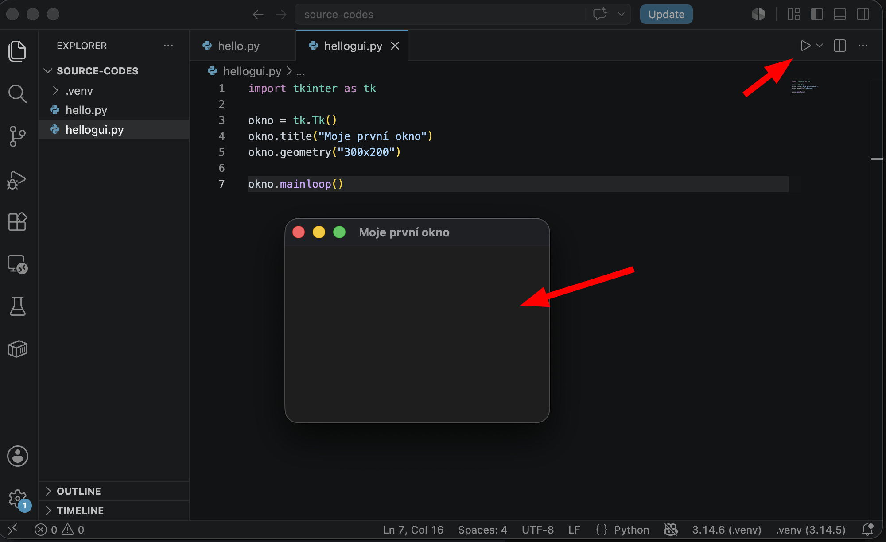

# Vytvoření okna aplikace

Skripty v Pythonu se často používají v příkazovém řádku. Pro rychlou konverzi dat či automatizaci je to lepší. 

Naučíme se vytvořit i grafické rozhraní aplikace (*GUI*). Je přehlednější pro méně zkušené uživatele, rychle se orientuješ a nemusíš si pamatovat příkazy.

<!-- TODO: Obrázek GUI -->

## První okno

Použijeme knihovnu `tkinter`. Kód pro vytvoření prázdného okna s titulkem vypadá takto:

```python
import tkinter as tk

okno = tk.Tk()
okno.title("Moje první okno")
okno.geometry("300x200")

okno.mainloop()
```

Vysvětlení:
- `tk.Tk()` vytvoří hlavní okno aplikace.
- `title()` nastaví text v záhlaví okna.
- `geometry("šířkaxvýška")` nastaví velikost okna v pixelech.
- `mainloop()` spustí okno a čeká na akce uživatele (klikání, psaní) – bez něj by se okno hned zavřelo.

Po spuštění skriptu vyskočí na obrazovce nové okno:



> `mainloop()` musí být na konci skriptu – vše, co chceš do okna přidat (tlačítka, popisky...), musíš napsat před něj.

<!-- TODO def -->

## Časté chyby
- Zapomenutý `okno.mainloop()` – okno se otevře a hned zmizí (skript doběhne do konce).
- Kód napsaný až za `mainloop()` – `mainloop()` se provádí, dokud okno nezavřeš. Pak teprve se provede kód za ním.

## AI Copilot
Zkus se AI zeptat:
- „Co dělá příkaz `mainloop()`?“
- „Jak se pozná, do kterého okna se widget má přiřadit?“
- „Přesuň textové pole vpravo od popisky (label). Tlačítko zvětš přes celou šířku okna. Vysvětli mi, jak se to dělá.“
- „Nauč mě, jak měnit pozici widgetů. Kód zatím nepiš. Ukaž mi návod s vysvětlením, zkusím kód upravit sám.“

> I tady platí: kód od AI si vždy ověř – spusť ho a zkontroluj, že okno vypadá a chová se, jak očekáváš.

## Knihovna `tkinter`

Knihovna `tkinter` je součástí Pythonu a umožňuje vytvářet grafická okna (GUI – grafické uživatelské rozhraní).

Ve Windows by knihovna měla být standardní součástí instalace Pythonu.

V Linuxu a macOSu je potřeba knihovnu doinstalovat.

Instalace v Linuxu (Debian/Ubuntu):
```shell
sudo apt update
sudo apt install python3-tk
python3 -c "import tkinter; tkinter._test()"
```

Instalace v macOS (Apple):
```shell
brew install python-tk
python3 -c "import tkinter; tkinter._test()"
```

Případně hledej návody na instalaci `tkinter` v&nbsp;Pythonu pro svůj operační systém.
