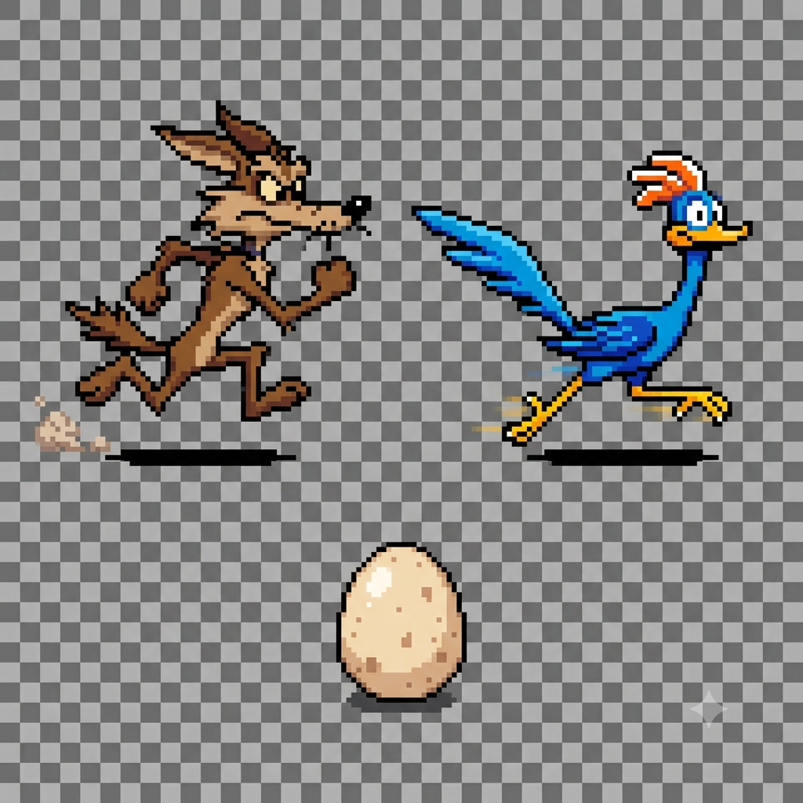

# Další možnosti využití AI

AI nemusíš využívat jen na psaní kódu. Tady je pár dalších způsobů, jak ti může s projektem pomoct.

## Plánování a nápady

AI můžeš využít i dřív, než napíšeš první řádek kódu – na promyšlení, jak projekt rozdělit na menší kroky, nebo na návrh, co by mohla tvoje aplikace umět.

```
Chci vytvořit aplikaci na sledování výdajů. Aplikace by měla být přístupná v mobilu. Navrhni mi vhodnou technologii. Jaké funkce by mohla mít a v jakém pořadí bych je měl/a naprogramovat.
```

```
Chtěl bych se naučit programovat v Pythonu. Jakou užitečnou jednoduchou aplikaci bych mohl vytvořit? Hraji šachy a rád také jezdím na kole.
```

## Průzkum dostupných technologií

Než se pustíš do programování, AI ti může pomoct zorientovat se v tom, jaké nástroje, knihovny nebo herní enginy na daný úkol existují a v čem se liší.

```
Chci vytvořit jednoduchou hru s grafikou. Jaké mám možnosti (knihovny, herní enginy) a v čem se od sebe liší?
```

> AI umí rychle shrnout možnosti, ale ověř si, jestli je informace aktuální – technologie se mění rychleji, než se AI model naposledy „učil“.

## Generování obrázků a grafiky

Pro hry a aplikace s grafickým rozhraním potřebuješ obrázky – postavičky, pozadí, ikony. Řada AI nástrojů umí obrázek vytvořit podle textového popisu.

Můžeš vyzkoušet třeba nástroje:
- [Gemini AI](https://gemini.google.com/app) (klasický chatbot od Google, ale umí docela dobře generovat i obrázky)
- [Creen](https://www.creen.ai/).

```
Vytvoř obrázek kočky ve stylu pixel art, průhledné pozadí, velikost 64×64 px.
```

Tipy:
- Zadej konkrétní rozlišení (velikost) obrázku podle rozlišení hry tak, aby nebylo obrázek potřeba zvětšovat/zmenšovat.
- Požaduj průhledné pozadí obrázku.
- Pokud ve hře potřebuješ více obrázků, generuj je společně tak, aby styl obrázků navzájem odpovídal – aby nebyl každý obrázek v jiném grafickém stylu.



### Pozor na autorská práva!

> Pozor! 
> 1. Prozkoumej pravidla použití vygenerovaných obrázků ze služby, kterou jsi použil. Ne vždy můžeš obrázky používat bez omezení
> 2. AI může vygenerovat obrázky velmi podobné těm, které jsou chráněny autorským právem. Ulož si původní konverzaci jako doklad, jak jsi k obrázkům přišel.

Podívej se na následující konverzaci:
[generování obrázků kojota a kukačky](https://gemini.google.com/app/bcd57c432b34a546)

Porovnej výsledný obrázek s obrázky kojota a kukačky z oblíbeného dětského seriálu *Road Runner* od Looney Tunes and Merrie Melodies.


## Vylepšení kódu

Požádej AI, ať navrhne vylepšení tvého projektu:
- Vylepšení funkčnosti – jaké funkce by šlo přidat, jak by šly vylepšit.
- Vylepšení vzhledu – jaké úpravy grafického uživatelského prostředí by zlepšily vzhled projektu.
- Požádej AI, ať prohlédne kód projektu a zkontroluje, jestli kód splňuje „best practices“ (doporučení pro zápis kódu v daném programovacím jazyce). Šlo by něco zapsat elegantněji?
- Požádej AI o kontrolu bezpečnosti aplikace. Nelze na to spolehat stoprocentně, ale některé chyby AI najde.

```
Navrhni mi 3 konkrétní způsoby, jak zlepšit uživatelský zážitek mé aplikace. Zaměř se na jednoduchost ovládání, přehlednost rozhraní a to, co by uživatelé nejspolečněji ocenili.
```

```
Prohlédni můj kód a navrhni, jak ho zlepšit z hlediska přehlednosti, struktury a best practices. Zaměř se hlavně na to, co bych mohl/a přepsat elegantněji nebo lépe pojmenovat.
```

```
Najdi v mém projektu možné chyby nebo slabá místa z hlediska bezpečnosti, výkonu a spolehlivosti. U každého problému napiš, proč je důležitý a jak ho opravit.
```

```
Navrhni mi několik nápadů, jak rozšířit funkce mé aplikace. Zaměř se na užitečné doplňky, které by zlepšily její hodnotu pro uživatele.
```

> Vylepšení můžeš použít i na kód generovaný AI. Když AI zaměříš na konkrétní aspekt, najde více, než když se „soustředí“ na zadání samotné. Kapacita modelů AI není neomezená.

## AI jako učitel programování

AI se nemusíš ptát jen na hotové řešení. Můžeš ji požádat, ať ti nejdřív jen vysvětlí princip, nebo tě úlohou provede po malých krocích, aniž by rovnou napsala celý kód.

```
Buď můj učitel programování. Nevypisuj mi řešení, jen mi krok za krokem vysvětli, jak bych měl/a postupovat.
```

> Tenhle způsob použití je pomalejší, ale naučíš se z něj mnohem víc, než kdyby ti AI jen napsala hotový kód. Musíš být mnohem aktivnější a proto si postup lépe zapamatuješ

## Testovací data

Při vývoji potřebuješ data, se kterými program vyzkoušíš – třeba seznam desítek jmen zákazníků nebo ukázkový JSON soubor. AI umí takový vzorek dat rychle vygenerovat.

```
Vygeneruj JSON soubor s 10 ukázkovými zákazníky – jméno a datum nákupu.
```

## Časté chyby
- Přebrání zastaralé nebo nepřesné informace o technologii bez ověření.
- Použití vygenerovaného obrázku bez kontroly, k čemu ho smíš použít (licenční podmínky nástroje, který ho vytvořil).
- Požádání AI rovnou o hotové řešení místo postupného vysvětlení – o to snáz zapomeneš, jak a proč to funguje.

## Vyzkoušej

1. Vyzkoušej zlepšit některý z předchozích projektů.
2. Použij AI pro návrh zadání závěrečného projektu v rámci kurzu.
3. Použij AI pro generování obrázků do projektu (zejména u her).
